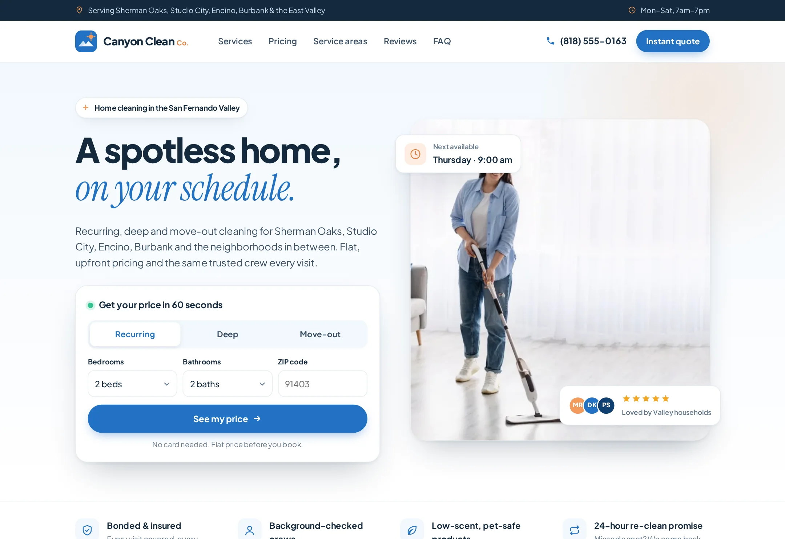

# Canyon Clean Co.

Instant-quote lead site for a Los Angeles home cleaning company serving the San Fernando Valley.

**Live demo:** https://www.freelancerportfoliohub.com/jameslee/projects/canyonclean/index.html



## Overview

Canyon Clean Co. is a Sherman Oaks–based cleaning company covering Encino, Studio City, Burbank and the
neighborhoods in between. The site is built around one idea: show people their price right away. Every page
carries a quick-quote widget that hands bedrooms, bathrooms, service type and ZIP to the full quote page, where
a live estimator shows a flat price, frequency discount, add-ons and estimated crew hours as the visitor fills
in the form. Requests are re-priced on the server and delivered to the office as a single lead.

## Features

- **Instant quote calculator** – client component driven by a pure pricing module (`lib/pricing.ts`) that is
  shared with the API, so the price on screen is the price that gets stored.
- **Quick-quote widgets** – plain GET forms (via `next/form`) that pre-fill the calculator through the query
  string and work before hydration.
- **Neighborhood pages** – `/house-cleaning/[area]` statically generated from `lib/data/areas.ts`, each with its
  own copy, local FAQs, review, pre-filled ZIP and links to nearby areas.
- **Quote API** – `POST /api/quote` validates with zod, recalculates the total, checks ZIP coverage and forwards
  the lead to a webhook (CRM / automation) or the server log.
- **Services & add-ons** – full checklists per service, add-on pricing and day-of expectations.
- **Accessible by default** – skip link, native `<details>` menus and FAQs, labelled fields, keyboard-friendly
  custom radios and visible focus states.
- **Local SEO** – per-page metadata, `HouseCleaning` JSON-LD, sitemap and redirects from the legacy `.html` URLs.

## Tech stack

- [Next.js 15](https://nextjs.org/) (App Router, React Server Components) and React 19
- TypeScript (strict, `noUncheckedIndexedAccess`)
- zod for request validation
- Hand-written CSS with design tokens (`app/globals.css`), `next/font` for Plus Jakarta Sans and Instrument Serif
- Vitest for the pricing unit tests

## Getting started

```bash
pnpm install
cp .env.example .env.local   # optional
pnpm dev
```

Open http://localhost:3000.

### Environment variables

| Variable               | Required | Description                                                             |
| ---------------------- | -------- | ----------------------------------------------------------------------- |
| `NEXT_PUBLIC_SITE_URL` | No       | Canonical site URL used in metadata and the sitemap.                    |
| `LEAD_WEBHOOK_URL`     | No       | Endpoint that receives quote requests as JSON. Logs to stdout if unset. |
| `LEAD_WEBHOOK_SECRET`  | No       | Sent as a bearer token with each webhook request.                       |

## Pricing model

| Service   | Base | Per bedroom | Per bathroom | Frequency discounts                        |
| --------- | ---- | ----------- | ------------ | ------------------------------------------ |
| Recurring | $109 | $15         | $20          | weekly 20%, every 2 weeks 15%, monthly 10% |
| Deep      | $189 | $30         | $35          | one-time only                              |
| Move-out  | $239 | $35         | $40          | one-time only                              |

Add-ons are added before the discount; pets that shed add a $15 pet-hair detail. See `lib/pricing.test.ts` for
worked examples.

## Project structure

```
app/
  api/quote/            POST handler for quote requests
  house-cleaning/[area] neighborhood pages (static params from lib/data/areas.ts)
  legal/[slug]          privacy, terms and accessibility
  quote/                instant quote calculator
  services/             services, add-ons and day-of details
  layout.tsx, page.tsx  shell and homepage
components/
  areas/                neighborhood page sections
  home/                 homepage sections (hero, pricing, coverage map…)
  layout/               top bar, header, mobile nav, footer
  quote/                calculator, estimate card, quick-quote form
  services/             service rows, add-on grid
  shared/               CTA band, review card, area card
  ui/                   icons, buttons, checklists, FAQ accordion
lib/
  data/                 typed content: services, areas, reviews, FAQs, plans
  pricing.ts            quote engine (+ pricing.test.ts)
  quote-schema.ts       zod schemas and query-string prefill
  leads.ts, coverage.ts lead delivery and ZIP coverage
types/                  shared content and quote types
public/images/          photography
```

## Scripts

| Script           | Description                      |
| ---------------- | -------------------------------- |
| `pnpm dev`       | Start the dev server (Turbopack) |
| `pnpm build`     | Production build                 |
| `pnpm start`     | Serve the production build       |
| `pnpm lint`      | ESLint (`next/core-web-vitals`)  |
| `pnpm typecheck` | `tsc --noEmit`                   |
| `pnpm test`      | Run the Vitest suite             |
| `pnpm format`    | Format with Prettier             |
